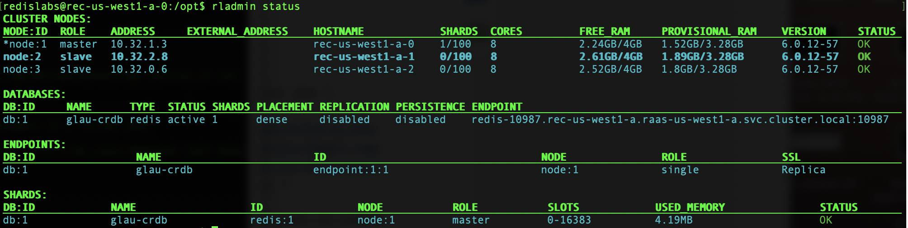
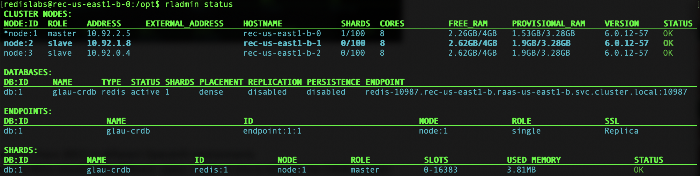

# How to Create an Active-active Database (CRDB) in Redis Enterprise for Google Kubernetes Engine (GKE)

## High Level Workflow
The following is the high level workflow which you will follow:
1. Create two GKE clusters
2. Create Redis Enterprise Cluster / Install Nginx ingress controller / Apply the `activeActive` spec on each GKE cluster
3. Document the required parameters
4. Formulate the CRDB creation JSON payload using the parameters *from both RECs* in a single JSON document
5. POST the JSON payload *to one* of the REC's API endpoints. (Yes, just one; it will coordinate with the other(s).)
6. Run a workload

#### 1. Build two GKE clusters:
```
./create_cluster.sh glau-aa-us-west1-a us-west1-a
./create_cluster.sh glau-aa-us-east1-b us-east1-b
```

#### 2. Create Redis Enterprise Cluster / Install Nginx ingress controller in each GKE cluster
Deploy REC in "raas-us-west1-a" namespace of the GKE cluster in us-west1-a region:
```
./bundle.sh raas-us-west1-a
```
You should see the following after you run "kubectl get all":
```
NAME                                             READY   STATUS              RESTARTS   AGE
pod/redis-enterprise-operator-7f58bd467c-5jdqk   0/1     ContainerCreating   0          2s

NAME                                        READY   UP-TO-DATE   AVAILABLE   AGE
deployment.apps/redis-enterprise-operator   0/1     1            0           3s

NAME                                                   DESIRED   CURRENT   READY   AGE
replicaset.apps/redis-enterprise-operator-7f58bd467c   1         1         0       3s
```
Now create a Redis Enterprise Cluster named rec-us-west-1-a:
```
kubectl apply -f rec/rec-us-west1-a.yaml
```
Now you should see the following after you run "kubectl get all".  It will take a few minutes to complete creation of the cluster:
```
NAME                                                  READY   STATUS    RESTARTS   AGE
pod/rec-us-west1-a-0                                  2/2     Running   0          8m13s
pod/rec-us-west1-a-1                                  2/2     Running   0          6m17s
pod/rec-us-west1-a-2                                  2/2     Running   0          4m6s
pod/rec-us-west1-a-services-rigger-5cc8877ff5-2qkr7   1/1     Running   0          8m14s
pod/redis-enterprise-operator-7f58bd467c-5jdqk        1/1     Running   0          13m

NAME                        TYPE        CLUSTER-IP     EXTERNAL-IP   PORT(S)                      AGE
service/rec-us-west1-a      ClusterIP   None           <none>        9443/TCP,8001/TCP,8070/TCP   8m15s
service/rec-us-west1-a-ui   ClusterIP   10.40.25.222   <none>        8443/TCP                     8m15s

NAME                                             READY   UP-TO-DATE   AVAILABLE   AGE
deployment.apps/rec-us-west1-a-services-rigger   1/1     1            1           8m16s
deployment.apps/redis-enterprise-operator        1/1     1            1           13m

NAME                                                        DESIRED   CURRENT   READY   AGE
replicaset.apps/rec-us-west1-a-services-rigger-5cc8877ff5   1         1         1       8m16s
replicaset.apps/redis-enterprise-operator-7f58bd467c        1         1         1       13m

NAME                              READY   AGE
statefulset.apps/rec-us-west1-a   3/3     8m15s
```
Install Ingress Controller (Nginx) in "ingress-nginx" namespace of the GKE cluster in us-west1-a region:
```
kubectl apply -f ingress/nginx-ingress-controller.yaml
```

You should see the following after you run "kubectl get all -n ingress-nginx". It will take a few minutes to complete the deployment.
```
NAME                                            READY   STATUS      RESTARTS   AGE
pod/ingress-nginx-admission-create-wbpb9        0/1     Completed   0          47m
pod/ingress-nginx-admission-patch-ltrfg         0/1     Completed   1          47m
pod/ingress-nginx-controller-6d95d4fc94-bswr7   1/1     Running     0          47m

NAME                                         TYPE           CLUSTER-IP     EXTERNAL-IP   PORT(S)                      AGE
service/ingress-nginx-controller             LoadBalancer   10.40.25.163   34.105.40.1   80:31456/TCP,443:32004/TCP   48m
service/ingress-nginx-controller-admission   ClusterIP      10.40.23.4     <none>        443/TCP                      48m

NAME                                       READY   UP-TO-DATE   AVAILABLE   AGE
deployment.apps/ingress-nginx-controller   1/1     1            1           48m

NAME                                                  DESIRED   CURRENT   READY   AGE
replicaset.apps/ingress-nginx-controller-6d95d4fc94   1         1         1       48m

NAME                                       COMPLETIONS   DURATION   AGE
job.batch/ingress-nginx-admission-create   1/1           3s         48m
job.batch/ingress-nginx-admission-patch    1/1           4s         48m
```

Retrieve EXTERNAL-IP of the ingress-controller:
```
kubectl get service/ingress-nginx-controller  -n ingress-nginx
```
Apply the activeActive spec to rec-us-west1-a (Redis Enterprise Cluster):
REC at rec-us-west1-a:
```
  activeActive:
    apiIngressUrl: api-raas-us-west1-a.rec-us-west1-a.<EXTERNAL-IP>.nip.io
    dbIngressSuffix: -raas-us-west1-a.rec-us-west1-a.<EXTERNAL-IP>.nip.io
    method: ingress
    ingressAnnotations:
      nginx.ingress.kubernetes.io/ssl-passthrough: "true"
      kubernetes.io/ingress.class: "nginx"
```
In our example, the spec looks like this:
```
  activeActive:
    apiIngressUrl: api-raas-us-west1-a.rec-us-west1-a.34.105.40.1.nip.io
    dbIngressSuffix: -raas-us-west1-a.rec-us-west1-a.34.105.40.1.nip.io
    method: ingress
    ingressAnnotations:
      nginx.ingress.kubernetes.io/ssl-passthrough: "true"
      kubernetes.io/ingress.class: "nginx"
```
You can validate that these were applied by describing the rec as follows:
```
kubectl get rec -n raas-us-west1-a -o json | jq '.items[].spec.activeActive'
```
The output should look like the following:
```
{
  "apiIngressUrl": "api-raas-us-west1-a.rec-us-west1-a.34.105.40.1.nip.io",
  "dbIngressSuffix": "-raas-us-west1-a.rec-us-west1-a.34.105.40.1.nip.io",
  "ingressAnnotations": {
    "kubernetes.io/ingress.class": "nginx",
    "nginx.ingress.kubernetes.io/ssl-passthrough": "true"
  },
  "method": "ingress"
}
```
Check if ingress is created:
```
kubectl get ingress -n raas-us-west1-a
```
The output should look like this:
```
NAME             CLASS    HOSTS                                                   ADDRESS       PORTS   AGE
rec-us-west1-a   <none>   api-raas-us-west1-a.rec-us-west1-a.34.105.40.1.nip.io   34.105.40.1   80      2m
```
This indicates that a route has been created to access the API endpoint externally.
Grab creds for rec:
```
kubectl get secrets -n raas-us-west1-a rec-us-west1-a  -o json | jq '.data | {username}[],{password}[] | @base64d'
```
Query the cluster through the API endpoint:
```
curl -k -u <username>:<password> https://api-raas-us-west1-a.rec-us-west1-a.<EXTERNAL-IP>.nip.io/v1/cluster
Ex. curl -k -u demo@redislabs.com:NeEkHiq1 https://api-raas-us-west1-a.rec-us-west1-a.34.105.40.1.nip.io/v1/cluster
```
At this point, the Redis Enterprise Cluster named rec-us-west1-a is set up for Active-Active Geo Replication.


Now, deploy REC in "raas-us-east1-b" namespace of the GKE cluster in us-east1-b region:
```
./bundle.sh raas-us-east1-b
kubectl apply -f rec/rec-us-east1-b.yaml
```
Install Ingress Controller (Nginx) in "ingress-nginx" namespace of the GKE cluster in us-east1-b region:
```
kubectl apply -f ingress/nginx-ingress-controller.yaml
```
Wait a couple minutes, then retrieve EXTERNAL-IP of the ingress-controller:
```
kubectl get service/ingress-nginx-controller  -n ingress-nginx
```
Apply the activeActive spec to rec-us-east1-b (Redis Enterprise Cluster):
REC at rec-us-east1-b:
```
  activeActive:
    apiIngressUrl: api-raas-us-east1-b.rec-us-east1-b.<EXTERNAL-IP>.nip.io
    dbIngressSuffix: -raas-us-east1-b.rec-us-east1-b.<EXTERNAL-IP>.nip.io
    method: ingress
    ingressAnnotations:
      nginx.ingress.kubernetes.io/ssl-passthrough: "true"
      kubernetes.io/ingress.class: "nginx"
```
You can validate that these were applied by describing the rec as follows:
```
kubectl get rec -n raas-us-east1-b -o json | jq '.items[].spec.activeActive'
```
The output should look like the following:
```
{
  "apiIngressUrl": "api-raas-us-east1-b.rec-us-east1-b.34.75.99.216.nip.io",
  "dbIngressSuffix": "-raas-us-east1-b.rec-us-east1-b.34.75.99.216.nip.io",
  "ingressAnnotations": {
    "kubernetes.io/ingress.class": "nginx",
    "nginx.ingress.kubernetes.io/ssl-passthrough": "true"
  },
  "method": "ingress"
}
```
Check if ingress is created:
```
kubectl get ingress -n raas-us-east1-b
```
Grab creds for rec:
```
kubectl get secrets -n raas-us-east1-b rec-us-east1-b  -o json | jq '.data | {username}[],{password}[] | @base64d'
```
Query the cluster thru the API endpoint:
```
curl -k -u <username>:<password> https://api-raas-us-east1-b.rec-us-east1-b.<EXTERNAL-IP>.nip.io/v1/cluster
Ex. curl -k -u demo@redislabs.com:wC0EU6B0 https://api-raas-us-east1-b.rec-us-east1-b.34.75.99.216.nip.io/v1/cluster
```

#### 3. Document the required parameters
**Required Parameters**
The following parameters will be required to form the JSON payload to create the CRDB.
| Parameter | Parameter Name in REST API | Description | How to get it? |
| --------- | ---  |  --- | --- |
| <a href="name"></a>Cluster FQDN | `name`  | This is the name of the REC from the REC perspective  | `curl -u <user>:<password> https://<rec_api>/v1/cluster \| jq .name` |
| <a href="url"></a>API URL | `url`  | This is the route the API endpoint as specified in `apiIngressURL`. Should be prefixed with `https://` | `kubectl get rec -o json -n <namespace> \| jq '.items[].spec.activeActive.apiIngressUrl'` |
| Cluster Admin Username/password | `credentials` | Cluster Admin role username/password | `kubectl get secrets -n <namespace> <cluster_name> -o json \| jq '.data \| {username}[],{password}[] \| @base64d'` |
| Replication Endpoint | `replication_endpoint`  | This will be <`your_db_name`><`dbIngressSuffix`>:443 where `dbIngressSuffix` is specified in your `activeActive` spec | `kubectl get rec -o json -n <namespace> \| jq '.items[].spec.activeActive.dbIngressSuffix'` |
| Replication TLS SNI | `replication_tls_sni` | This is the same as your `replication_endpoint`, but no port number required. | As above.


Here is an example when creating a CRDB with database name <i>glau-crdb</i>:
| Parameter Name in REST API | Example value |
| -------------------------- | ------------- |
| `name` | rec-us-west1-a.raas-us-west1-a.svc.cluster.local |
| `url` | `https://api-raas-us-west1-a.rec-us-west1-a.34.105.40.1.nip.io` |
| `credentials` | username: `demo@redislabs.com`, password: `something` |
| `replication_endpoint` | <i>glau-crdb</i><span style="color:orange">-raas-us-west1-a.rec-us-west1-a.34.105.40.1.nip.io</span>:443 |
| `replication_tls_sni` | <i>glau-crdb</i><span style="color:orange">-raas-us-west1-a.rec-us-west1-a.34.105.40.1.nip.io</span> |


#### 4. Formulate the CRDB creation JSON payload
Create the JSON payload for CRDB creation request as in this <a href="./crdb.json" target="_blank">example</a> using the required parameters. Save the file as `crdb.json` in your current working directory.
```
{
  "default_db_config": {
    "name": "<db_name>",
    "replication": false,
    "memory_size": 10240000,
    "aof_policy": "appendfsync-every-sec",
    "shards_count": 1
  },
  "instances": [
    {
      "cluster": {
        "url": "<site_a_api_endpoint>",
        "credentials": {
          "username": "<site_a_username>",
          "password": "<site_a_password>"
        },
        "name": "<site_a_rec_name/fqdn>",
        "replication_endpoint": "<site_a_replication_endpoint>443",
        "replication_tls_sni": "<site_a_replication_endpoint>"
      }
    },
    {
      "cluster": {
        "url": "<site_b_api_endpoint>",
        "credentials": {
          "username": "<site_b_username>",
          "password": "<site_b_password>"
        },
        "name": "<site_b_rec_name/fqdn>",
        "replication_endpoint": "<site_b_replication_endpoint>:443",
        "replication_tls_sni": "<site_b_replication_endpoint>"
      }
    }
  ],
  "name": "<db_name>",
  "encryption": true,
  "compression": 0
}
```

#### 5. POST the JSON payload to one of the REC's API endpoints
In this step you will make the Active-Active DB request to just one cluster member. *Why just one?* This request is coordinated among members: You request one member to initiate the coordination *by including* the list of, and credentials for, each Active-Active DB member.

Apply the following to the API endpoint at *just one* cluster API endpoint:

`curl -k -u demo@redislabs.com:NeEkHiq1 https://api-raas-us-west1-a.rec-us-west1-a.34.105.40.1.nip.io/v1/crdbs -X POST -H 'Content-Type: application/json' -d @crdb.json`

*Note:* `curl` some users are having difficulty specifying the payload with the `-d` argument. Please consult your curl manual or try postman.

You should see a reply from the API as in the following which indicates the payload was well formed and the request is being actioned:
```
{
  "id": "9644de6c-1bef-4ebe-b010-3a4e6199138b",
  "status": "queued"
}
```
*Note* Did you get something other than `queued` as a response? Then proceed to the [troubleshooting](#troubleshooting-steps) section of the document.

<a href="crdb_tasks"></a>
You can get the status of the above task by issuing a GET on `/v1/crdbs_tasks/<id>`. Here is an example of a successful task:
```
$ curl -k -u demo@redislabs.com:NeEkHiq1 https://api-raas-us-west1-a.rec-us-west1-a.34.105.40.1.nip.io/v1/crdb_tasks/9644de6c-1bef-4ebe-b010-3a4e6199138b
{
  "crdb_guid": "805be1c6-0b27-47b1-8461-00b8465981c9",
  "id": "9644de6c-1bef-4ebe-b010-3a4e6199138b",
  "status": "finished"
}
```

Verify if a CRDB instance is created on the Redis Enterprise Cluster (rec-us-west1-a):
```
kubectl exec -it rec-us-west1-a-0 -n raas-us-west1-a -c redis-enterprise-node -- /bin/bash
Once you are inside the container:
rladmin status
```
You should see the database metadata like the following:


Verify if the corresponding CRDB instance is created on the Redis Enterprise Cluster (rec-us-east1-b):
```
kubectl exec -it rec-us-east1-b-0 -n raas-us-east1-b -c redis-enterprise-node -- /bin/bash
Once you are inside the container:
rladmin status
``` 



Try to connect to the database from one of the Redis Enterprise Cluster node:
Grab the database endpoint:
```
curl -k -u demo@redislabs.com:NeEkHiq1 https://api-raas-us-west1-a.rec-us-west1-a.34.105.40.1.nip.io/v1/bdbs | jq '.[0].endpoints[0].dns_name'
curl -k -u demo@redislabs.com:wC0EU6B0 https://api-raas-us-east1-b.rec-us-east1-b.34.75.99.216.nip.io/v1/bdbs | jq '.[0].endpoints[0].dns_name'
```
Grab the database port:
```
curl -k -u demo@redislabs.com:NeEkHiq1 https://api-raas-us-west1-a.rec-us-west1-a.34.105.40.1.nip.io/v1/bdbs | jq '.[0].endpoints[0].port'
```
Connect to the database:
```
kubectl exec -it rec-us-west1-a-0 -n raas-us-west1-a -c redis-enterprise-node -- /bin/bash
redis-cli -h <database endpoint> -p <database port>
kubectl exec -it rec-us-east1-b-0 -n raas-us-east1-b -c redis-enterprise-node -- /bin/bash
redis-cli -h <database endpoint> -p <database port>
```

Connect to REC CM:
```
https://web-ui-raas-us-east1-b.rec-us-east1-b.34.75.99.216.nip.io

https://web-ui-raas-us-west1-a.rec-us-west1-a.34.105.40.1.nip.io/
```


#### 6. Run a workload

<a href="workload"></a>
It's time to test your deployment. You can use the redis benchmarking tool `memtier_benchmark` <a href="https://github.com/RedisLabs/memtier_benchmark" _target="blank">[link]</a>. Here are a couple of examples deployment manifests: 

1. <a href="./benchmark.yaml" _target="blank">Benchmark without TLS</a>.
2. <a href="./benchmark-tls.yaml" _target="blank">Benchmark with TLS</a>, required when working through Openshift Routes.

Below is an example invocation of `memtier_benchmark` as from the commandline which is as-is reflected in the manifest file linked above: <a href="./benchmark-tls.yaml" _target="blank">Benchmark with TLS</a>. This invocation should yield somewhere between 3k and 10k requests per second. If you want to generate more workload, adjust the `Limits` and `requests` values in this manifest: `memtier_benchmark` will consume as much resources as are given to it. 
```
memtier_benchmark -a YkBybC5jb20= -s db-raas-site-a.apps.bbokdoct.redisdemo.com -p 443 --tls --tls-skip-verify --sni db-raas-site-a.apps.bbokdoct.redisdemo.com --ratio=1:3 --data-size-pattern=R --data-size-range=128-2800 --requests=20000000 --pipeline=1 --clients=4 --threads=5 --run-count=3
```
What do the arguments above mean?
* `-a <password>`, `-s <server>`, `-p <port>`: use Redis basic [`Auth`](https://redis.io/commands/auth) (without a specified user) to connect to a Redis `server` on a specified `port`.
* `--tls --tls-skip-verify`: Use TLS but to not verify server identity. If you've installed your own server certs or installed our CA then `--tls-skip-verify` is likely unnecessary.
* Other options are fairly straight forward: 
  * Use a `1:3` W:R ratio 
  * Randomize the data size between `128` and `2800` Bytes
  * Execute `20M` commands with only one command per requests (`--pipeline=1`)
  * Create `4` clients with `5` working threads each
  * Do all the above 3 times.  

To apply the benchmark workload: 
1. Edit the arguments in the file. 
   * You can specify values directly with `env: {name, value}` pairs:
      ```
      env:
        - name: REDIS_PORT
          value: "443"
      ```
   * You can also get the values from K8s Secrets as in the following: 
      ```
      - name: REDIS_PASSWORD
        valueFrom:
            secretKeyRef:
              key: password
              name: redb-redis-db1 
      ```
2. Apply the manifest: `oc apply -f benchmark-tls.yaml`. If the arguments are properly specified then you will see a deployment and pod created for this workload. 

```
$ oc get all
NAME                                             READY   STATUS    RESTARTS   AGE
pod/redis-benchmark-tls-fd5df8549-wm4xs          1/1     Running   0          8m9s

NAME                                        READY   UP-TO-DATE   AVAILABLE   AGE
deployment.apps/redis-benchmark-tls         1/1     1            1           88m
```

Alas, this is not a `memtier_benchmark` tutorial. Feel free to try out some of the other command line options. 


## Troubleshooting Steps

1. Symptom: API endpoint not reachable
The API endpoint is not reachable from one cluster to the other. 
   
    * Open a shell side a one of the Redis Enterprise cluster pods:
  
      ```
      kubectl exec  -it  rec-us-west1-a-0 -c redis-enterprise-node -n raas-us-west1-a -- /bin/bash
      $ curl -ivk https://api-raas-us-west1-a.rec-us-west1-a.34.105.40.1.nip.io
      ...
      HTTP/1.1 401 UNAUTHORIZED
      ...
      WWW-Authenticate: ... realm="rec-us-west1-a.raas-us-west1-a.svc.cluster.local"
      ```
      It is expected that you will get a "401" response but check that the returned "realm" reflects the remote cluster's FQDN as in [Required Parameters: `name`](#name).

    * Perform the same step as above from the other site, to the former. 
    * If one or both of these steps above do not result in "401" with the appropriate "realm" then investigate your Nginx ingress controller setup related to the [REC API endpoint](#url). 
  

1. API response 400, bad request:
    ```
    {
    "detail": "None is not of type 'object'",
    "status": 400,
    "title": "Bad Request",
    "type": "about:blank"
    }
    ```
    * Your payload is not being passed to the API or the payload is not valid JSON. Please Lint your JSON or try Postman with built-in JSON validate.

1. The Active-Active DB request was accepted and completed, but replication is not taking place. This is likely the case if either or both DB ingress routes are not working properly.


